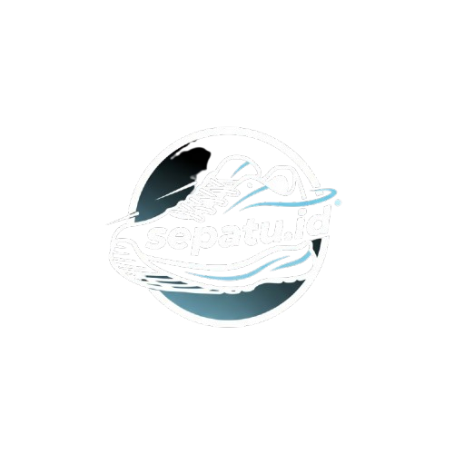

<div align="center">
  <a href="#">
    
  </a>

  <h1>✨ SEPATU.ID 👟</h1>

  <p>
    <strong>Premium Footwear Catalog & Store Interface</strong>
  </p>

  <p>
    <a href="https://developer.mozilla.org/en-US/docs/Web/HTML">
      
    </a>
    <a href="https://developer.mozilla.org/en-US/docs/Web/CSS">
      
    </a>
    <a href="https://developer.mozilla.org/en-US/docs/Web/JavaScript">
      
    </a>
    <a href="https://fontawesome.com/">
      
    </a>
  </p>
</div>

---

## 📖 Deskripsi

**Sepatu.id** adalah platform katalog sepatu online berbasis web modern yang dirancang untuk memberikan pengalaman browsing produk yang **elegan, cepat, dan responsif**.

Website ini menampilkan koleksi sepatu dari berbagai brand ternama seperti **Nike, Adidas, dan Puma**, dilengkapi dengan fitur **pencarian interaktif** serta **filter produk yang canggih**.

Project ini dibangun dengan pendekatan desain:

- ✨ **Glassmorphism**
- 🎨 **Minimalist UI**
- 📱 **Mobile-First Approach**

---

## 📸 Preview


---

## 🚀 Fitur Utama

- 👟 **Katalog Interaktif**  
  Grid produk rapi dengan gambar berkualitas tinggi dan efek hover halus.

- 🔍 **Live Search**  
  Pencarian sepatu secara real-time tanpa reload halaman menggunakan JavaScript.

- ⚡ **Smart Filtering**  
  Filter produk berdasarkan:
  - Brand (Nike, Adidas, Puma)
  - Rentang harga

- 📱 **Fully Responsive Design**
  - **Desktop**: Sidebar filter statis & grid layout luas  
  - **Mobile**: Hamburger menu, off-canvas filter, grid 1 kolom

- 🎨 **Modern UI/UX**
  - Font **Poppins**
  - Glassmorphism card
  - Smooth transition & AOS animation

- 🛒 **Detail Produk Lengkap**
  - SKU
  - Deskripsi
  - Pilihan ukuran
  - Link pembelian eksternal

---

## 🛠 Tech Stack

### Core Technology
- **HTML5** – Semantic Structure
- **CSS3** – Flexbox, Grid, CSS Variables, Media Queries
- **Vanilla JavaScript (ES6+)** – DOM Manipulation & Event Handling

### Libraries & Assets
- **AOS (Animate On Scroll)**
- **Font Awesome 6**
- **Google Fonts – Poppins**

---

## 📂 Struktur Folder & Halaman

| Path / File | Deskripsi |
|-------------|----------|
| `/index.html` | Login Page (Glassmorphism UI) |
| `/register.html` | Register Page |
| `/utama/utama.html` | Homepage |
| `/utama/tentang.html` | About Us |
| `/produk/produk.html` | Katalog & Filter Produk |
| `/produk/[nama].html` | Detail Produk |
| `/js/` | JavaScript Modules |
| `/asset/` | Images, Logo, Background |

---

## ⚙️ Instalasi & Menjalankan Project

Project ini merupakan **Static Website**, tidak membutuhkan backend atau Node.js.

### 1️⃣ Clone Repository
```bash
git clone https://github.com/username-anda/sepatu-id.git
cd sepatu-id
```

## 2️⃣ Menjalankan Project

Project ini merupakan **Static Website**, sehingga tidak memerlukan backend atau server khusus.

### Opsi A — VS Code Live Server (Disarankan)

1. Buka folder project di **Visual Studio Code**
2. Install ekstensi **Live Server**
3. Klik kanan pada file `index.html`
4. Pilih **Open with Live Server**

### Opsi B — Manual

1. Buka **File Explorer**
2. Masuk ke folder project
3. Double click file `index.html` untuk membuka di browser

---

## ⚠️ Catatan Pengembangan

### 📦 Data Produk
Data produk untuk fitur **Live Search** disimpan dalam array `products`  
di file: `/js/search.js`


Jika ingin menambahkan produk baru, pastikan untuk meng-update array tersebut.

### 🔗 Link Pembelian
Tombol **Beli** saat ini diarahkan ke marketplace eksternal  
(contoh: **Shopee**) sebagai keperluan demonstrasi.

---

## 🤝 Kredit & Sumber

- **Inspirasi Desain**  
  Modern E-Commerce UI & Glassmorphism Trends

- **Gambar Produk**  
  Official Website **Nike**, **Adidas**, **Puma**  
  *(Digunakan untuk keperluan edukasi & portofolio)*

---

## 📄 Lisensi

Project ini dibuat untuk tujuan **pembelajaran dan portofolio**.  
Seluruh merek dagang, logo, dan aset brand merupakan milik  
pemegang hak cipta masing-masing.

---

<div align="center">
  Made with ❤️ using HTML, CSS & JavaScript  
  <br>
  <strong>by chandracornelius13</strong>
</div>
